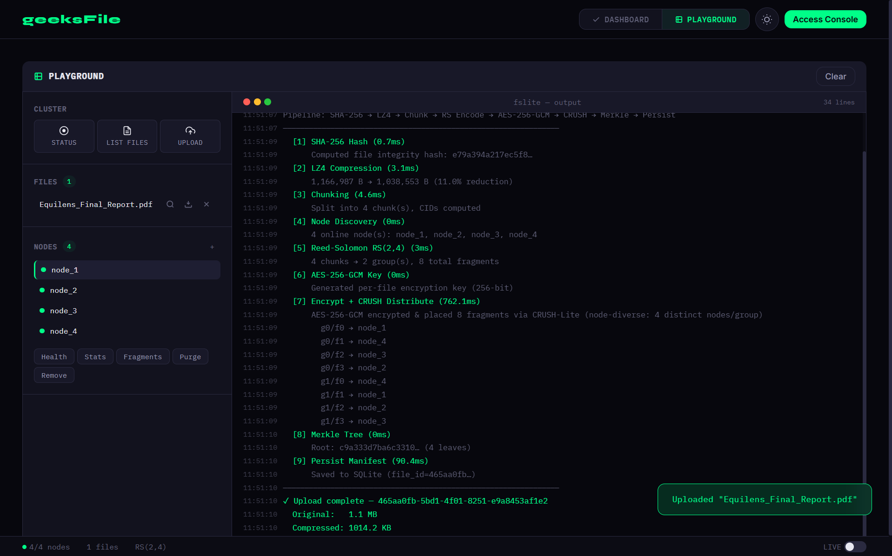
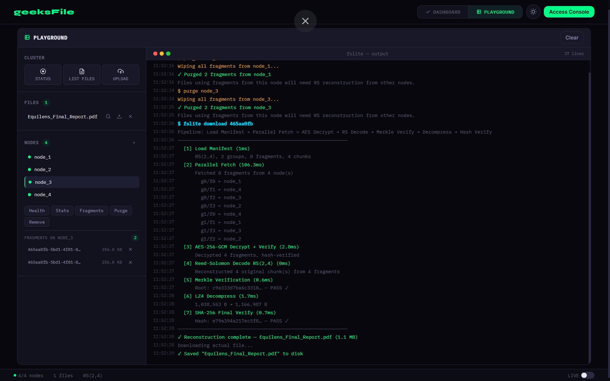
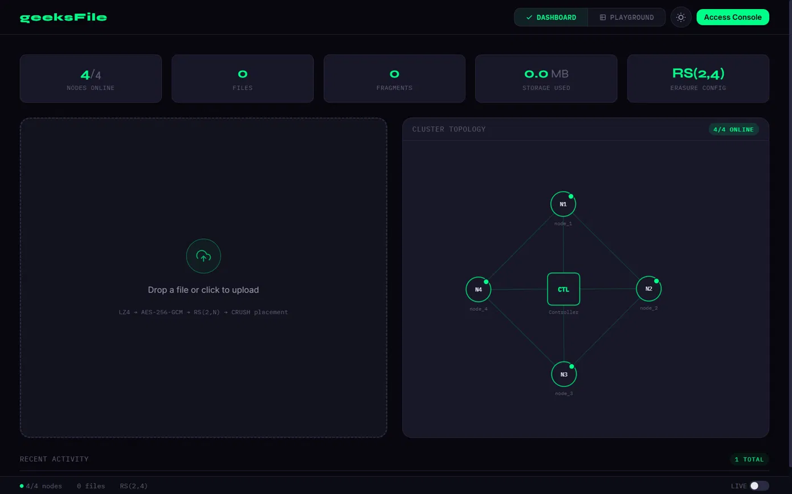

# geeksFile

A distributed file system, built from scratch. Reed-Solomon erasure coding,
AES-256-GCM encryption, intelligent placement, Merkle verification. (With a
live web dashboard.)

🔗 **Live demo:** [geeksfile.onrender.com](https://geeksfile.onrender.com)
📂 **Implementation:** private — architecture, design, and demos in this repo

---

## What this is

You upload a file. It gets compressed, split into chunks, erasure-coded into
encrypted fragments, scattered across a cluster of storage nodes, and indexed
in a manifest. You download it. Surviving nodes hand back their fragments,
Reed-Solomon reconstructs whatever's missing, AES-GCM decrypts, Merkle tree
verifies nothing was tampered with, and the file lands on your disk exactly
as it went in.

That's the whole pitch. The interesting part is everything happening in
between, and that's what the live demo and these docs are about.

A FastAPI controller orchestrates the pipeline and exposes a REST API.
Storage nodes are independent FastAPI processes you can spawn and kill at
runtime. The frontend is a Preact SPA that visualises the cluster as a
force-directed graph and streams per-stage pipeline telemetry as files move
through the system.

The code is private. Everything else lives here.

---

## Demo

The system runs end-to-end. Files get compressed, chunked, erasure-coded into
encrypted fragments, placed across the cluster, and reconstructable from any
surviving K-of-N fragments per group. The screenshots below are from a real
session.

### Upload pipeline



*Nine stages, each with timing. SHA-256 integrity hash → LZ4 compression
(11% reduction here) → 256 KB chunking → Reed-Solomon RS(2,4) encode →
AES-256-GCM encryption with per-fragment nonces → CRUSH-Lite distribution
(node-diverse placement shown per fragment) → Merkle tree → SQLite manifest.
This is what the Playground shows you when you upload a file.*

### Fault tolerance — recovery after node purge



*The headline claim of erasure coding, actually demonstrated. I purged
fragments from `node_3`, then asked for the file back. The system fetched
surviving fragments in parallel, decrypted them, reconstructed the missing
chunks via Reed-Solomon, verified the Merkle root, decompressed, and ran a
final SHA-256 check. Both verifications PASS. The file is identical to what
went in.*

### Cluster topology



*Ground controller at the centre, satellite nodes around it. Live health,
storage stats, erasure config. The graph updates as nodes come and go.*

---

## Architecture

## Architecture

```
┌───────────────────────┐
│   Web UI (Preact SPA) │  ← Dashboard + Playground
│   :9000 (static)      │
└───────────┬───────────┘
            │
┌───────────▼───────────┐
│   Ground Controller   │  ← FastAPI (REST API + orchestration)
│   :9000               │
└───────────┬───────────┘
            │
  ┌─────────┼─────────┐
  │         │         │
┌─▼──┐   ┌─▼──┐   ┌──▼─┐   ┌────┐
│ N1 │   │ N2 │   │ N3 │   │ N4 │   ← Storage Nodes (FastAPI)
│8001│   │8002│   │8003│   │8004│      + dynamically added nodes
└────┘   └────┘   └────┘   └────┘
```

Five layers, each independent. Controller, storage nodes, placement,
replication, UI. You can swap any of them without touching the others.
Storage nodes are real processes — the controller spawns and kills them on
demand via the REST API.

---

## The interesting parts

### The pipeline is the product

Every upload runs through nine stages. Every download runs through seven.
The Playground view streams the telemetry as it happens: compression ratio,
fragment counts, exactly which node each fragment landed on, per-stage
latency, the Merkle root, the manifest write. The thing distributed systems
people complain about — that you can't see what's happening — is the thing
this UI is built around.

### Placement isn't random

CRUSH-Lite scores each fragment-node pair as
`hash(fragment_key || node_id) × node_weight`, where `node_weight` accounts
for available storage and latency. Within a group, fragments are forced onto
distinct nodes, so RS redundancy actually translates into fault tolerance —
killing one node never kills a group.

### Reconstruction is parallel

On download, `asyncio.gather()` fires K parallel fetches per group across
surviving nodes. If a node is slow or dead, the next one fills in. The LRU
cache (512 fragments) skips the network entirely for hot reads.

### Nothing is unverified

Every chunk has a SHA-256 CID. The chunks combine into a Merkle tree, root
stored in the manifest. On download, the tree is rebuilt and compared. AES-GCM
gives per-fragment authentication on top. Corruption, tampering, or
out-of-order chunks all fail verification before the bytes reach you.

---

## What this demonstrates

- **Distributed storage primitives end-to-end.** Erasure coding, replication,
  fault-tolerant placement, cryptographic integrity; implemented, not
  imported as a black box.
- **A working control plane.** Dynamic membership (add/remove nodes at
  runtime via REST), health checks, per-node statistics, and event streaming.
- **Observability over invisibility.** The Playground view streams stage-by-stage
  pipeline telemetry — compression ratio, fragment count, placement choices,
  per-stage timing — making the internals of an upload visible in real time.
- **A real frontend, not a Swagger page.** Preact + signals + a force-directed
  D3 cluster graph that updates as the cluster changes.
- **A real CLI.** Six commands, Rich terminal output, useful for both
  demos and scripting.

---

## Technical Details

### Erasure Coding
- K = 2 data shards, N = adaptive (4–6) total shards per chunk group
- Reed-Solomon over GF(2^8) via `zfec`
- Reconstructable from any K of N fragments per group
- Node-diverse placement: each fragment in a group lands on a distinct node

### Encryption
- AES-256-GCM authenticated encryption
- 256-bit random key per file (stored in the manifest)
- 96-bit random nonce per fragment
- Wire format: `nonce(12 B) || ciphertext || tag(16 B)`

### CRUSH-Lite Placement
```
score(fragment, node) = hash(fragment_key || node_id) × node_weight
node_weight       = available_mb / (1 + latency_factor)
```
Group-level selection ensures all N fragments in a group are placed on N
distinct nodes, so RS fault tolerance is actually realised in practice.

### Merkle Verification
- Binary SHA-256 tree over ordered chunk CIDs
- Root hash stored in the manifest, verified on every download
- Detects corruption, tampering, and incorrect chunk ordering

### Caching
- LRU fragment cache (512 items) on the controller for hot fragments
- Skips network round-trips entirely on repeat reads

---

## REST API (selected)

| Endpoint | Method | Purpose |
|----------|--------|---------|
| `/cluster` | GET | Cluster status (nodes, health) |
| `/upload` | POST | Upload file |
| `/upload-verbose` | POST | Upload with per-stage telemetry |
| `/download/{file_id}` | GET | Download file (streaming) |
| `/files` | GET | List all files |
| `/nodes` | POST | Add a node (spawns a process) |
| `/nodes/{node_id}` | DELETE | Remove a node (kills the process) |
| `/events` | GET | System event feed |

Seventeen endpoints total. The full surface is available against the live
demo.

---

## Stack

- **Backend:** Python 3, FastAPI, Uvicorn, SQLAlchemy, SQLite
- **Crypto & coding:** PyCryptodome (AES-256-GCM), zfec (Reed-Solomon),
  LZ4 (compression), `hashlib` (SHA-256 + Merkle)
- **Frontend:** Preact, htm, signals, vanilla JS
- **HTTP:** httpx (async client), multipart/form-data, streaming responses

---

## References

- DeCandia et al. (2007). *Dynamo: Amazon's highly available key-value store.*
  SOSP '07. — placement, replication, and quorum patterns.
- Plank, J. S. (1997). *A tutorial on Reed-Solomon coding for fault-tolerance
  in RAID-like systems.* — erasure coding foundations.
- Weil et al. (2006). *CRUSH: Controlled, scalable, decentralized placement
  of replicated data.* SC '06. — inspiration for the placement function.
- Merkle, R. C. (1988). *A digital signature based on a conventional
  encryption function.* CRYPTO '87. — Merkle tree verification.

---

## Design Notes

Worth flagging one alternative that was on the table and didn't ship.

The most interesting one was a **controller-as-fragment-holder** model:
instead of all N fragments living on satellite nodes, the controller holds
fragment `f0` and each node holds one of the remaining N. With RS(K=2), this
means *controller + any single surviving node* can reconstruct any file — a
strong fit for the satellite framing where the controller is "ground" and
nodes are "in orbit."

The cost is statelessness. Storing fragments on the controller turns it from
a stateless coordinator into critical infrastructure. Storage overhead goes
from ~200% to ~250% (for N=4), and the controller's failure-domain coupling
gets noticeably tighter.

The current implementation keeps RS(2, 4) with all fragments on satellite
nodes and a stateless controller. The fragment-holder model is documented as
a candidate for an optional deployment flag — useful for demo or
recovery-maximised scenarios, not for production where coordinator failure
should be cheap.

See [`docs/resilience-design-notes.md`](docs/resilience-design-notes.md)
for the full discussion.

---

## References

- DeCandia et al. (2007). *Dynamo: Amazon's highly available key-value store.*
  SOSP '07. Placement, replication, and quorum patterns.
- Plank, J. S. (1997). *A tutorial on Reed-Solomon coding for fault-tolerance
  in RAID-like systems.* Erasure coding foundations.
- Weil et al. (2006). *CRUSH: Controlled, scalable, decentralized placement
  of replicated data.* SC '06. Inspiration for the placement function.
- Merkle, R. C. (1988). *A digital signature based on a conventional
  encryption function.* CRYPTO '87. Merkle tree verification.

---

## Status

Working prototype. Demonstrable end-to-end via the live deployment.
Implementation is private; this repo captures the public-facing architecture,
the demos, and the design thinking.

---

## License
Documentation, diagrams, and content in this repository are licensed under
[CC BY 4.0](https://creativecommons.org/licenses/by/4.0/).
The implementation code is not included in this repository.
